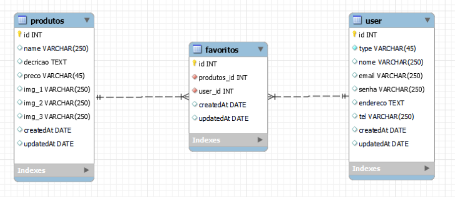
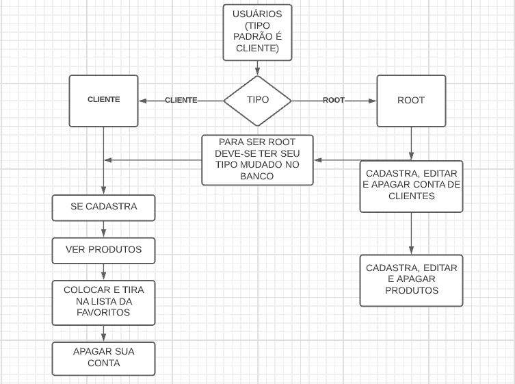

# Back End - Desafio Técnico da Gama-XP-40

Bom para iniciar vamos ver a estrutura do banco de dados.

# Banco de Dados

O banco de dados escolhido foi o MySql, para este desafio foi essario três tabelas com o relacionameto 1 para n.

# Plano de negocio

Aquitedura escollhida para o desenvolvimeto da api foi o MVC.

# O que é MVC?

Em poucas palavras, mvc é um acrônimo para o termo em inglês Model View and Controller que facilita a troca de informações entre a interface do usuário e os dados no banco de dados, tornando as respostas mais rápidas e dinâmicas.

