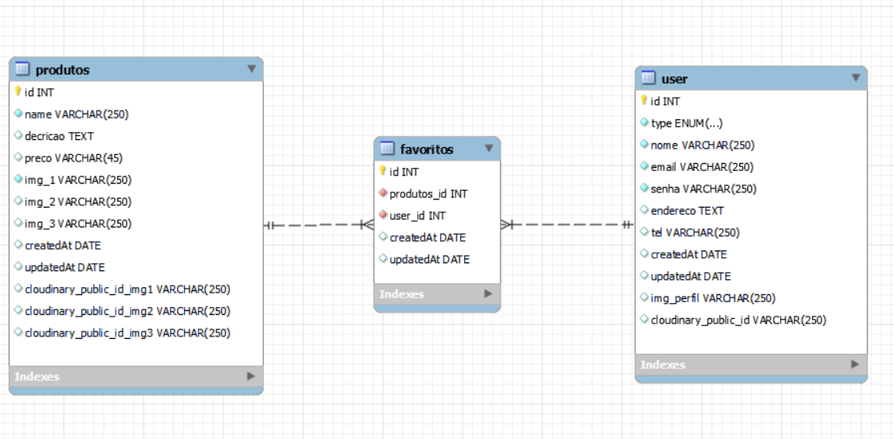

# Back End - Desafio Técnico da Gama-XP-40

Bom para iniciar vamos ver a estrutura do banco de dados.

# Banco de Dados

O banco de dados escolhido foi o MySql, para este desafio foi essario três tabelas com o relacionameto 1 para n.

# Plano de negocio

Aquitedura escollhida para o desenvolvimeto da api foi o MVC.

# O que é MVC?

Em poucas palavras, mvc é um acrônimo para o termo em inglês Model View and Controller que facilita a troca de informações entre a interface do usuário e os dados no banco de dados, tornando as respostas mais rápidas e dinâmicas.

# Funcionalidades

<ol>
  <li>[x] Cadastra usuario (cliente ou root) e produtos</li>
  <li>[x] Editar usuario e produto</li>
  <li>[x] Buscar por um usuario ou produto especifico</li>
  <li>[x] Sistema de like ou de lista de favoritos</li>
  <li>[x] Upload de imagens de perfil e de produtos, o armazenamento é feito no cloudinary e o link das images é guardado no banco de dados</li>
  <li>[x] Deletar usuario e produtos</li>
</ol>

# Comandos Sequelize 

### Criando migrations
yarn sequelize migration:create --name nome-da-migration

### subindo migrations
yarn sequelize db:migrate

### desfazendo migrations
yarn sequelize db:migrate:undo:all
